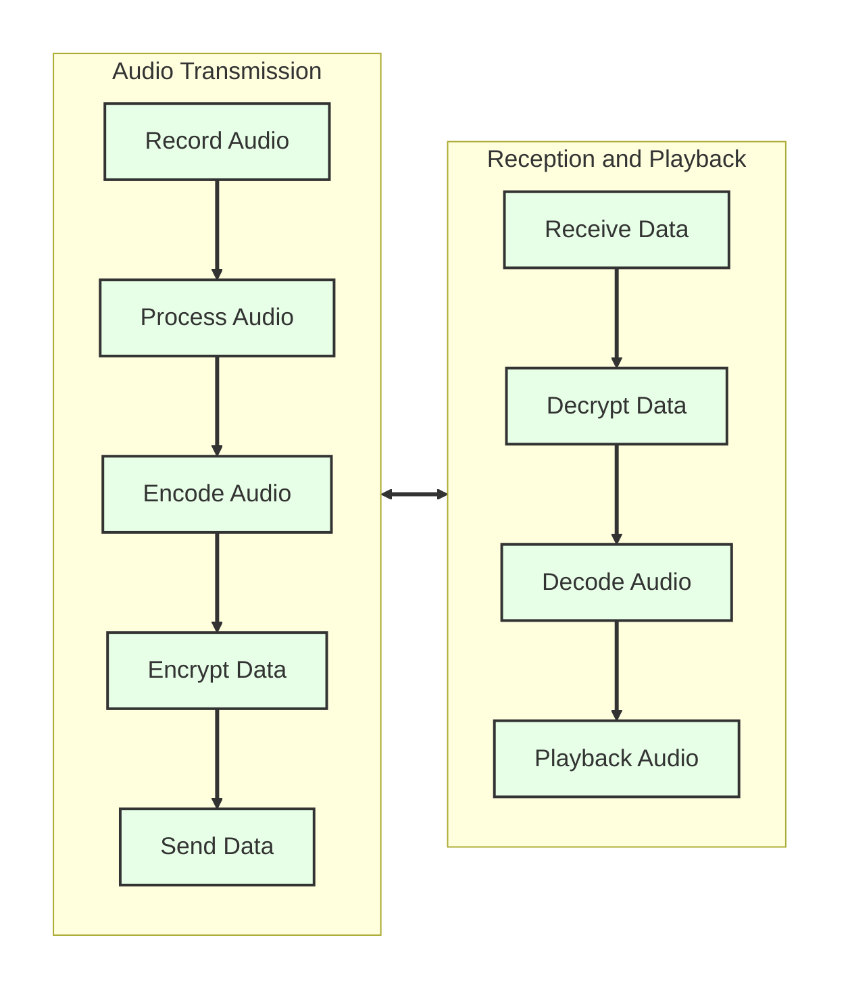

# Senior Design Project - Team 312

**Share Point Quick Link:** [Project SharePoint](https://fsu-my.sharepoint.com/personal/amw21i_fsu_edu/_layouts/15/Doc.aspx?sourcedoc={c8d6e6cb-04f5-4a5c-a4a4-ac70581ecfba}&action=edit&wd=target%28Class%20Handouts.one%7C43749e4e-c570-4688-8d40-703e8b013bf2%2FSenior%20Design%20Projects%7C01b6a98f-3880-41ca-834b-d67c770890d6%2F%29&wdorigin=NavigationUrl)

---

**Table of Contents**

> _The links are clickable and will take you to that section or subsection._

- [**Operation Manual**](#operation-manual)

  - [How to start the device](#how-to-start-the-device)
  - [How to operate](#how-to-operate)

- [**Project Description**](#project-description)

  - [Overall Processes](#overall-processes)
  - [Audio Processing and Transmission](#audio-processing-and-transmission-of-data)
  - [Encryption/Decryption Information](#how-the-encryption-and-decryption-works)
  - [Materials](#materials)

- [**RPI Setup**](#rpi-setup)

  - [Flashing an OS](#flashing-an-os)
  - [How to SSH to rpi](#how-to-ssh-to-rpi)
  - [Driver Installation](#driver-installation)

- [**Coding Environment**](#coding-environment)

  - [Running the Code](#running-the-code)

- [**Creating a daemon**](#creating-a-daemon)

- [**Using Git**](#using-git)

  - [Setting up Git](#setting-up-git)
  - [Git usage](#git-usage)

- [**Documenting Python Code**](#documenting-python-code)

  - [Code Documentation](#code-documentation)
  - [Type Hinting Guide](#type-hinting-guide)

- [**Contributors**](#contributors)

**Resources:**

[KiCad](https://www.kicad.org/) - The circuit schematic and PCB design files are in the kicad folder.

[PEP 8 – Style Guide for Python Code](https://peps.python.org/pep-0008/#introduction) - Guideline for how to code in Python

[Python Project/Package Template](https://github.com/pypa/sampleproject) - To better understand the structure of the project, a template for python projects/packages can be viewed as a reference.

[Raspberry Pi pinout information](https://pinout.xyz/) - Useful for setting up buttons, switches, RF chip, etc. via the GPIO pins.

[Git Information](https://git-scm.com/book/en/v2) - Information on how to use git.

---

## Operation Manual:

A Guide on how to operate the end project will be discussed in this section.

### How to start the device:

Ideally a daemon could be used to start the program when booted up but there was a bug where the audio volume would only be set to 50%. The surefire way to get the device up and running is to first log in to the RPI5s and then configure it and and run the program manually:

```
alsamixer
```

- Set the volume to 100%

```
cd git/senior-design-312
penva
python src/managers/interface_manager.py
```

- This will start the program and show the logs in the terminal window

### How to operate

On the OLED screen there are two menus, Settings, and mode.

The Settings menu allows for the user to select and deselect the encryption for the device.

```
PENC - Packet Encryption: This is enables or disables the transceivers on board AES encryption.

DENC - Data Encryption: THis enables or disables the software encryption of the data.
```

In the Mode menu, the user can select the desired type of encryption for the data.

```
AES - Standard AES-256 Encryption

RSA - (NOT IMPLEMENTED) RSA Encryption

HYB - Hybrid Encryption method: RSA encrypted AES key
```

---

Volume Control

- The rotary encoder is used to change the onboard volume, which can be seen at the top left of the screen.

Selection of menu options

- The center button is used to select options in the menu.

Returning to the main menu

- The left button is used to return to the home screen.

Navigation

- The up and down buttons navigate through the menus.

Transmitting

- Pressing and holding the right button will start the transmission of the voice data from one device to the other. Releasing it will stop the transmission. Like a walkie-talkie, only one transceiver can be transmitting at a time.

---

## Project Description:

The purpose of the project is to have a hardware implementation for voice encryption. The approach taken was to use two Raspberry Pi 5's that are capable of encrypting and decrypting audio streams using AES or RSA. The encrypted stream is then sent to another Raspberry Pi via the RFM69 915MHz transceiver where it is then decrypted and played back. The functionality is like that of a rudimentary military grade radio (encrypted walkie talkie).

### Overall Processes:

To record the audio a button on the device is pressed, starting a thread to handle recording the audio and then transmitting it as shown in the diagram. The receiving device, upon receiving the RF signal and start sequence will start playing back the audio.



### Audio Processing and Transmission of data:

[Diagrams and information](docs/design_flow_diagrams.md)

### How the encryption and decryption works:

This design used AES 256, RSA 4096, and a hybrid method that is outlined below:
[AES-256](docs/aes.md)
[RSA-4096](docs/rsa.md)

### Materials:

- [Raspberry Pi 5](https://www.adafruit.com/product/5813)
- [RPI UPS](https://www.amazon.com/Geekworm-X1200-Raspberry-Shutdown-Detection/dp/B0CRYVC8C5/ref=sr_1_5?crid=3T93BCIOWTPNQ&dib=eyJ2IjoiMSJ9.DSS9mwB54EGjoH9xGkIHFd17faf9UodmdVZNEF_NOwU1_TtXE9s5ghDnBO93wSyNeB1lbRl8e1wEuyPHb3ZzxMwYsCVhmp-j85LuohlRSUfx-YZh10-CHeAW6Z2ln4s2YudasiG1aBX-cWL1VihQCH_vzZzjAtUG9teGnXM9BbOQCqw_GdSpZU175fsOAMTuqZAPb5n3mfgUwXqlgPdfhwnoqzu5ng3niiaieRxPhM2FF5Hz5nVOXCaIMCLdwqQHWaklxH1ObAC3PyNYaox4awEBOQx2zcOAy6-PPfX7jiT5Lc-Iv-FmTJBIp-wI4evsTNgZJfQ-FAyS--bPdEAYpfdK69StwQNbdMvML9t9LII.ysi9Ba5JT9anmJP7jrCq64x9GX5JekWu3_toRT-0F-U&dib_tag=se&keywords=rpi5+ups+geekworm&qid=1743437047&s=electronics&sprefix=rpi5+ups+geekworm%2Celectronics%2C111&sr=1-5)
- [ANO Directional Navigation](https://www.adafruit.com/product/5001)
- [RFM69HCW Transceiver](https://www.adafruit.com/product/3070)
- [Voice Bonnet](https://www.adafruit.com/product/4757)
- [OLED Display](https://www.amazon.com/dp/B0CHF7LHVT?ref=ppx_yo2ov_dt_b_fed_asin_title&th=1)
- [Speaker](https://www.adafruit.com/product/4227)

---

## RPI Setup:

### Flashing an OS:

1. Download the [Raspberry PI imager](https://www.raspberrypi.com/software/)

2. Select RPI 5 as device and Raspian 64-bit Lite as OS
   2.1 - For all the drivers for this project, a non desktop version must be used.

3. Customize settings before flashing

   - Name the device (ex. rpi5-312)
   - Set username (ex. team312)
   - Set password (ex. password)
   - Enable SSH in second tab
   - Finally flash the SD card with the OS

4. Plug SD card in, power on

---

### How to SSH to rpi:

_This step is optional_

Using powershell or terminal (must be on same network)

```bash
ssh [username]@[device name].local
```

- Follow steps to allow connection

- To make life simpler going forward, get the VS code extension _Remote Explorer_
  - Then follow steps to make a SSH connection in VS code.

---

### Driver Installation:

- This will update all the base packages and drivers for the Raspberry Pi.

  ```bash
  sudo apt update
  sudo apt -y upgrade
  sudo reboot
  ```

  - The following steps are for ease of installation of all the necessary packages/drivers for the RPI. Running the setup script will install all the packages as well as create a virtual python environment in the _senior-design-312_ directory.

  - This script also adds aliases to the .bashrc and exports the directory of the project to PYTHONPATH.

  ADDED ALIASES:

  - ptree - shows the tree of the directory, excludes some of the unimportant files.
  - penvca - Creates and activates a python virtual environment in _**.env**_
  - penva - Activates the python virtual environment.

  ```bash
  sudo apt install -y git
  mkdir git
  cd git
  git clone https://github.com/adamzoiss/senior-design-312.git
  cd senior-design-312
  cd setup_utils
  chmod +x setup.sh
  ./setup.sh
  ```

  - After the reboot, change the directory to _senior-design-312_ and run:

    ```bash
    penva
    ```

  All of the code should now be ready to run in the project.

---

## Coding Environment:

- When running the code ensure that the virtual environment is activated, if the setup script was run, in the project directory, run:
  ```bash
  penva
  ```

---

### Running the Code:

- Assuming the setup script was run to configure the RPI, ensure the virtual environment is activated (.env) to the left of your bash info, and run:

  ```bash
  python "path to python program"
  ```

- To run the tests and view the statistics, run:
  ```bash
  pytest
  ```

---

## Creating a daemon:

A daemon is a background process that runs continuously and independently of user interaction. It starts at boot (or when needed) and runs in the background, typically without a graphical interface. Daemons are often used for tasks like logging, networking, and running services (like web servers, audio managers, etc.). In the case of this project, a daemon is used to start the interface manager program on boot, and if it crashes, restarts the program.

- Creating a Systemd Service:
  ```bash
  sudo nano /etc/systemd/system/run-py-program.service
  ```
  > This should be pasted and modified to use the correct python path, program directory, and _pi_ username

```
[Unit]
Description=My Python Script Daemon
After=network.target sound.target
Wants=pulseaudio.service


[Service]
ExecStart=/home/pi/git/senior-design-312/.env/bin/python /home/pi/git/senior-design-312/src/managers/interface_manager.py
WorkingDirectory=/home/adamzoiss/git/senior-design-312
Environment="PYTHONPATH=/home/pi/git/senior-design-312"
User=pi
Group=pi
Restart=always
RestartSec=5
StandardOutput=append:/home/pi/git/senior-design-312/logs/system.log
StandardError=append:/home/pi/git/senior-design-312/logs/system.err


[Install]
WantedBy=multi-user.target
```

- Allow Systemd to use pulse audio:

  > By default, PulseAudio does not allow system services to access it. Run:

  ```
  sudo nano /etc/pulse/client.conf
  ```

  - At the end of the file, add:
    ```
    autospawn = yes
    ```
  - Then restart pulseaudio
    ```
    pulseaudio -k
    pulseaudio --start
    ```

- Enabling and staring the daemon:

  > To apply the changes made in the _.service_ file:

  ```
  sudo systemctl daemon-reload
  ```

  > To enable:

  ```
  sudo systemctl enable run-py-program.service
  ```

  > To start:

  ```
  sudo systemctl start run-py-program.service
  ```

  > View the status:

  ```
  sudo systemctl status run-py-program.service
  ```

  - More useful commands:
    ```
    sudo systemctl disable run-py-program.service
    sudo systemctl stop run-py-program.service
    sudo systemctl restart run-py-program.service
    ```

---

## Using Git:

Git is a distributed version control system designed to track changes in source code during software development. It allows multiple developers to collaborate on a project by managing code changes, maintaining a history of modifications, and enabling branching and merging workflows. Git ensures code integrity and simplifies collaboration by providing tools to resolve conflicts and review changes.

### Setting up Git:

- First set username and password via:

  ```bash
  git config --global user.name "github username"
  git config --global user.email "github email"
  ```

  - To verify they were set correctly:
    ```bash
    git config --global -l
    ```

  1. Make a github account (Make sure you set your username and email in global config)
  2. install _gh_ for github authentication
     ```bash
     sudo apt install gh
     gh auth login
     ```
  3. Follow steps and log in
  4. Verify with:
     ```bash
     gh auth status
     ```

---

### Git usage

- Always make edits in a `branch`, do not work directly on main. To see what branch is active:

  ```bash
  git branch
  ```

- To `checkout` an active branch with name _branchname_:

  ```bash
  git checkout branchname
  ```

- To create a new working branch:

  ```bash
  git checkout -b nameofbranch
  ```

- After making changes on a branch, save (`commit`) the changes by:

  ```bash
  git commit -a -m "brief description of what was done"
  ```

  - This saves the changes locally on your computer, to add (push the changes to github)
    ```bash
    git push origin branchname
    ```
    - Alternatively, If you want Git to automatically set upstream branches when pushing new local branches, you can enable:
      ```bash
      git config --global push.autoSetupRemote true
      ```
      This way, next time you create a new branch and push, Git will automatically set up the remote tracking branch. The command will now look like:
      ```bash
      git push
      ```

- Getting the most up to date code:
  - save changes that were done on your branch via a commit or stash
  - check out `main`
    ```bash
    git fetch
    ```
    ```bash
    git pull
    ```
  - the most up to date version of main is now what you see

---

## Documenting Python Code:

### Code Documentation

`numpy` style documentation is being used for this project.

**Example of a NumPy-style docstring:**

```python
import numpy as np

def compute_mean(arr):
    """
    Compute the mean of a NumPy array.

    Parameters
    ----------
    arr : numpy.ndarray
        Input array of numerical values.

    Returns
    -------
    float
        The mean (average) of the input array.

    Raises
    ------
    ValueError
        If the input is not a NumPy array.

    Examples
    --------
    >>> import numpy as np
    >>> arr = np.array([1, 2, 3, 4, 5])
    >>> compute_mean(arr)
    3.0
    """
    if not isinstance(arr, np.ndarray):
        raise ValueError("Input must be a NumPy array.")
    return arr.mean()
```

**Breakdown of the NumPy docstring format:**

- Short summary: The first line briefly describes what the function does.
- Parameters: List of arguments, types, and descriptions.
- Returns: Description of the return value and type.
- Raises: Expected exceptions that may be thrown.
- Examples: Demonstrates usage with `doctest`-style examples.

---

**Class with NumPy-style Docstrings**

This class represents a **Simple Linear Regression** model.

```python
import numpy as np

class SimpleLinearRegression:
    """
    A simple linear regression model using the least squares method.

    Attributes
    ----------
    coef_ : float
        The slope (coefficient) of the regression line.
    intercept_ : float
        The y-intercept of the regression line.

    Methods
    -------
    fit(X, y)
        Fits the model to the data.
    predict(X)
        Predicts values using the trained model.
    """

    def __init__(self):
        """
        Initializes the SimpleLinearRegression model with no trained parameters.
        """
        self.coef_ = None
        self.intercept_ = None

    def fit(self, X, y):
        """
        Fit the linear regression model to the given dataset.

        Parameters
        ----------
        X : numpy.ndarray
            Feature array of shape (n_samples,).
        y : numpy.ndarray
            Target array of shape (n_samples,).

        Raises
        ------
        ValueError
            If `X` and `y` have different lengths.

        Examples
        --------
        >>> import numpy as np
        >>> X = np.array([1, 2, 3, 4, 5])
        >>> y = np.array([2, 4, 6, 8, 10])
        >>> model = SimpleLinearRegression()
        >>> model.fit(X, y)
        """
        if len(X) != len(y):
            raise ValueError("X and y must have the same length.")

        X_mean = np.mean(X)
        y_mean = np.mean(y)

        num = np.sum((X - X_mean) * (y - y_mean))
        den = np.sum((X - X_mean) ** 2)

        self.coef_ = num / den
        self.intercept_ = y_mean - self.coef_ * X_mean

    def predict(self, X):
        """
        Predict the target values for given input data.

        Parameters
        ----------
        X : numpy.ndarray
            Feature array of shape (n_samples,).

        Returns
        -------
        numpy.ndarray
            Predicted values based on the trained model.

        Raises
        ------
        ValueError
            If the model has not been trained yet.

        Examples
        --------
        >>> import numpy as np
        >>> X = np.array([6, 7, 8])
        >>> model = SimpleLinearRegression()
        >>> model.fit(np.array([1, 2, 3, 4, 5]), np.array([2, 4, 6, 8, 10]))
        >>> model.predict(X)
        array([12., 14., 16.])
        """
        if self.coef_ is None or self.intercept_ is None:
            raise ValueError("Model is not trained. Call `fit` first.")

        return self.coef_ * X + self.intercept_
```

**NumPy Docstrings Benefits**

- Structured and readable: Clearly defines parameters, return values, and exceptions.
- Works with auto-documentation tools like Sphinx.
- Encourages best practices: Makes it easier to maintain and understand code.

---

### Type Hinting Guide:

1. Function Arguments & Return Types

   ```python
   def add(x: int, y: int) -> int:
       return x + y
   ```

   `x: int` and `y: int` specify that x and y should be integers.

   `-> int` means the function returns an integer.

2. Variable Annotations

   ```python
   name: str = "Alice"
   age: int = 25
   height: float = 5.9
   is_active: bool = True
   ```

3. Lists, Tuples, and Dictionaries

   Use `list`, `tuple`, and `dict` with generic types:

   ```python
   from typing import List, Tuple, Dict

   numbers: List[int] = [1, 2, 3, 4]
   point: Tuple[float, float] = (3.5, 7.2)
   person: Dict[str, int] = {"age": 30, "score": 95}
   ```

- `List[int]`: A list of integers.
- `Tuple[float, float]`: A tuple with two floats.
- `Dict[str, int]`: A dictionary with string keys and integer values.

4. Optional & Union Types

   **Optional Type (Allows `None`)**

   ```python
   from typing import Optional

   def get_user_name(user_id: int) -> Optional[str]:
       return "Alice" if user_id == 1 else None
   ```

   `Optional[str]` is equivalent to `Union[str, None]`.

   **Union (Multiple Types Allowed)**

   ```python
   from typing import Union

   def parse_value(value: Union[int, str]) -> str:
       return str(value)
   ```

   `Union[int, str]` means `value` can be an **int** or **str**.

5. Custom Classes as Types

   ```python
   class User:
       def __init__(self, name: str):
           self.name = name

   def greet(user: User) -> str:
       return f"Hello, {user.name}!"
   ```

   The function `greet` expects a `User` instance.

6. Callable (Hinting Functions)

   ```python
   from typing import Callable

   def execute(func: Callable[[int, int], int], x: int, y: int) -> int:
       return func(x, y)

   def multiply(a: int, b: int) -> int:
       return a * b

   result = execute(multiply, 3, 4)  # Returns 12
   ```

   `Callable[[int, int], int]` means a function that:

   - Takes two integeres.
   - Returns an integer.

7. Type Aliases (For Readability)

   ```python
   from typing import List

   Coordinates = List[Tuple[float, float]]  # Type alias

   route: Coordinates = [(10.0, 20.0), (30.5, 40.2)]
   ```

   Now, `Coordinates` can be used instead of `List[Tuple[float, float]]`.

8. Type Variables (For Generic Functions & Classes)

   _This is the same concept in C++ as `template <Typename T>`_

   ```python
   from typing import TypeVar, Generic

   T = TypeVar('T')  # Generic Type

   def repeat(value: T, times: int) -> List[T]:
       return [value] * times

   print(repeat("Hello", 3))  # ['Hello', 'Hello', 'Hello']
   ```

   Here:

   - `T` is a Type Variable that allows any type.
   - `repeat` works with any type, maintaining type safety.

9. TypedDict (For Struct-like Dictionaries)

   ```python
   from typing import TypedDict

   class UserDict(TypedDict):
       name: str
       age: int

   user: UserDict = {"name": "Alice", "age": 30}
   ```

   This ensures `user` has only the specified keys and types.

10. `Self` Type Hinting for Methods

    Introduced in Python 3.11, `Self` hints that a method returns an instance of its class.

    ```python
    from typing import Self

    class Animal:
        def set_name(self, name: str) -> Self:
            self.name = name
            return self  # Returns instance for method chaining

    dog = Animal().set_name("Buddy")
    ```

---

**Static Type Checking with `mypy`**

To enforce type checking, install mypy:

```bash
pip install mypy
```

Then run:

```bash
mypy my_script.py
```

This will flag type errors before runtime.

---

## Contributors:

Danielle Awoniyi : danielle1.awoniyi@famu.edu

Amira McKaige : amm21bc@fsu.edu

Amelia Wondracek : amw21i@fsu.edu

Travis Gabauer : tg21b@fsu.edu

Adam Zoiss : aez18@fsu.edu
