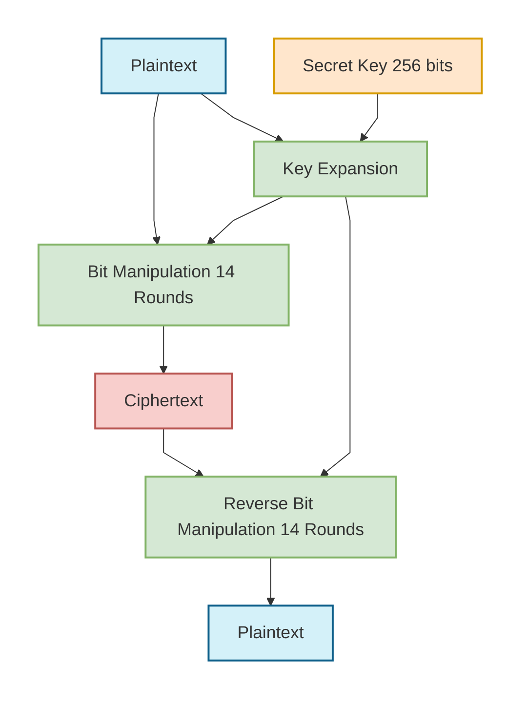
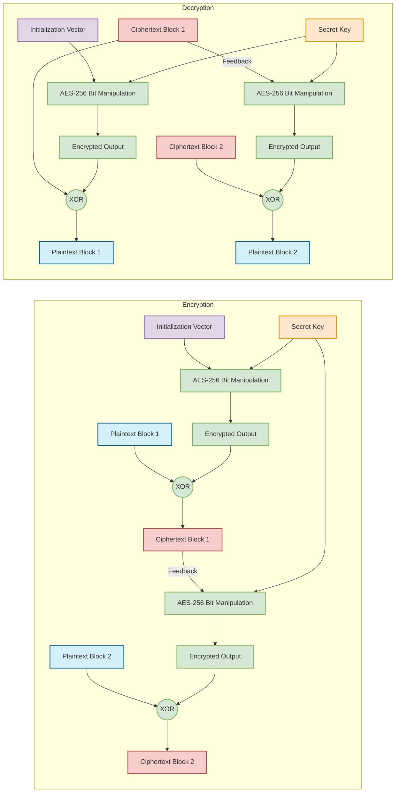

# AES Encryption and Decryption

## AES-256 Overview

AES (Advanced Encryption Standard) is a symmetric encryption algorithm that uses the same key for both encryption and decryption. AES-256 refers to the use of a 256-bit key size, which is currently considered secure against brute force attacks.

## Simplified AES-256 Process

## Key Components of AES-256

1. **Secret Key**: A 256-bit (32-byte) key used for both encryption and decryption
2. **Key Expansion**: Process that derives multiple round keys from the original secret key
3. **Bit Manipulation**: AES-256 uses 14 rounds of complex bit operations including:
   - Byte substitution
   - Row shifting
   - Column mixing
   - Key addition

## CFB Mode (Cipher Feedback)

In our implementation, we use AES in CFB (Cipher Feedback) mode, which turns the block cipher into a stream cipher, making it ideal for encrypting continuous data streams like audio.

## Advantages for Audio Encryption

- **Stream-based**: Can encrypt data of arbitrary length without padding
- **Partial Block Processing**: Efficient for real-time audio processing
- **Error Propagation**: Limited to one block, minimizing impact on audio quality
- **No Padding Required**: Simplifies the processing pipeline for continuous audio streams
