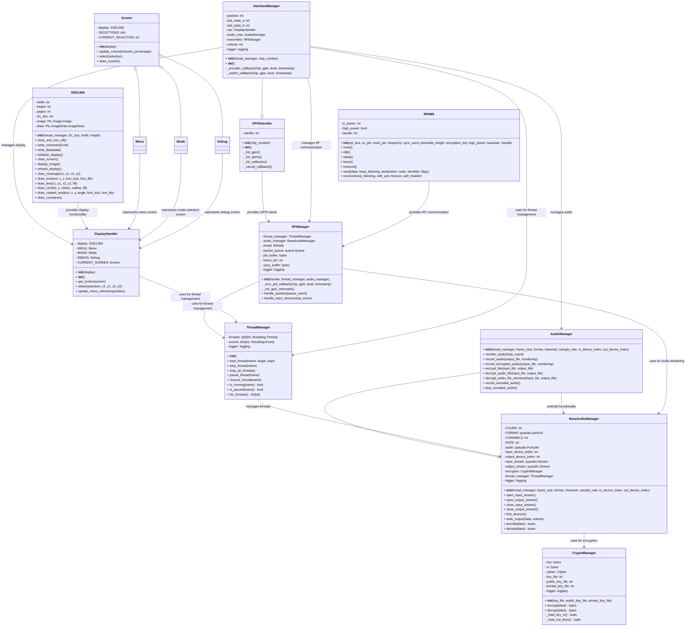

```mermaid
classDiagram
    class ThreadManager {
        - threads: dict[str, threading.Thread]
        - events: dict[str, threading.Event]
        - logger: logging
        + __init__()
        + start_thread(name, target, args)
        + stop_thread(name)
        + stop_all_threads()
        + pause_thread(name)
        + resume_thread(name)
        + is_running(name) bool
        + is_paused(name) bool
        + list_threads() list[str]
    }

    class CryptoManager {
        - key: bytes
        - iv: bytes
        - cipher: Cipher
        - key_file: str
        - public_key_file: str
        - private_key_file: str
        - logger: logging
        + __init__(key_file, public_key_file, private_key_file)
        + encrypt(data) bytes
        + decrypt(data) bytes
        - _load_key_iv() tuple
        - _load_rsa_keys() tuple
    }

    class BaseAudioManager {
        - CHUNK: int
        - FORMAT: pyaudio.paInt16
        - CHANNELS: int
        - RATE: int
        - audio: pyaudio.PyAudio
        - input_device_index: int
        - output_device_index: int
        - input_stream: pyaudio.Stream
        - output_stream: pyaudio.Stream
        - encryptor: CryptoManager
        - thread_manager: ThreadManager
        - logger: logging
        + __init__(thread_manager, frame_size, format, channels, sample_rate, in_device_index, out_device_index)
        + open_input_stream()
        + open_output_stream()
        + close_input_stream()
        + close_output_stream()
        + find_devices()
        + write_output(data, volume)
        + encode(data) bytes
        + decode(data) bytes
    }

    class AudioManager {
        + __init__(thread_manager, frame_size, format, channels, sample_rate, in_device_index, out_device_index)
        + monitor_audio(stop_event)
        + record_audio(output_file, monitoring)
        + record_encrypted_audio(output_file, monitoring)
        + encrypt_file(input_file, output_file)
        + decrypt_audio_file(input_file, output_file)
        + decrypt_audio_file_chunked(input_file, output_file)
        + record_encoded_audio()
        + play_encoded_audio()
    }
    AudioManager --|> BaseAudioManager

    class GPIOHandler {
        - handle: int
        + __init__(chip_number)
        + __del__()
        - _init_gpio()
        - _init_alerts()
        - _init_callbacks()
        - _cancel_callbacks()
    }

    class DisplayHandler {
        - display: SSD1306
        - MENU: Menu
        - MODE: Mode
        - DEBUG: Debug
        - CURRENT_SCREEN: Screen
        + __init__(display)
        + __del__()
        + get_screen(screen)
        + select(selection, x1, y1, x2, y2)
        + update_menu_selection(position)
    }

    class RFManager {
        - thread_manager: ThreadManager
        - audio_manager: BaseAudioManager
        - rfm69: RFM69
        - packet_queue: queue.Queue
        - pkt_buffer: bytes
        - frame_len: int
        - opus_buffer: bytes
        - logger: logging
        + __init__(handle, thread_manager, audio_manager)
        - _recv_pkt_callback(chip, gpio, level, timestamp)
        - _init_gpio_interrupts()
        + handle_packets(pause_event)
        + handle_input_stream(stop_event)
    }

    class InterfaceManager {
        - position: int
        - last_state_a: int
        - last_state_b: int
        - nav: DisplayHandler
        - audio_man: AudioManager
        - transmitter: RFManager
        - volume: int
        - logger: logging
        + __init__(thread_manager, chip_number)
        + __del__()
        - _encoder_callback(chip, gpio, level, timestamp)
        - _switch_callback(chip, gpio, level, timestamp)
    }
    InterfaceManager --|> GPIOHandler

    class SSD1306 {
        - width: int
        - height: int
        - pages: int
        - i2c_dev: int
        - image: PIL.Image.Image
        - draw: PIL.ImageDraw.ImageDraw
        + __init__(thread_manager, i2c_bus, width, height)
        + clear_and_turn_off()
        + write_command(cmd)
        + write_data(data)
        + initialize_display()
        + clear_screen()
        + display_image()
        + refresh_display()
        + clear_rectangle(x1, y1, x2, y2)
        + draw_text(text, x, y, font_size, font_file)
        + draw_line(x1, y1, x2, y2, fill)
        + draw_circle(x, y, radius, outline, fill)
        + draw_rotated_text(text, x, y, angle, font_size, font_file)
        + draw_constants()
    }

    class RFM69 {
        - tx_power: int
        - high_power: bool
        - handle: int
        + __init__(spi_bus, cs_pin, reset_pin, frequency, sync_word, preamble_length, encryption_key, high_power, baudrate, handle)
        + reset()
        + idle()
        + sleep()
        + listen()
        + transmit()
        + send(data, keep_listening, destination, node, identifier, flags)
        + receive(keep_listening, with_ack, timeout, with_header)
    }

    class Screen {
        - display: SSD1306
        - SELECTIONS: dict
        - CURRENT_SELECTION: int
        + __init__(display)
        + update_volume(volume_percentage)
        + select(selection)
        + draw_screen()
    }
    Screen <|-- Menu
    Screen <|-- Mode
    Screen <|-- Debug

    %% Interaction Diagram
    ThreadManager --> BaseAudioManager : manages threads
    BaseAudioManager --> CryptoManager : uses for encryption
    AudioManager --> BaseAudioManager : extends functionality
    RFManager --> ThreadManager : uses for thread management
    RFManager --> BaseAudioManager : uses for audio streaming
    GPIOHandler --> RFManager : provides GPIO alerts
    DisplayHandler --> ThreadManager : uses for thread management
    InterfaceManager --> DisplayHandler : manages display
    InterfaceManager --> AudioManager : manages audio
    InterfaceManager --> RFManager : manages RF communication
    InterfaceManager --> ThreadManager : uses for thread management
    SSD1306 --> DisplayHandler : provides display functionality
    RFM69 --> RFManager : provides RF communication
    Menu --> DisplayHandler : represents menu screen
    Mode --> DisplayHandler : represents mode selection screen
    Debug --> DisplayHandler : represents debug screen
```