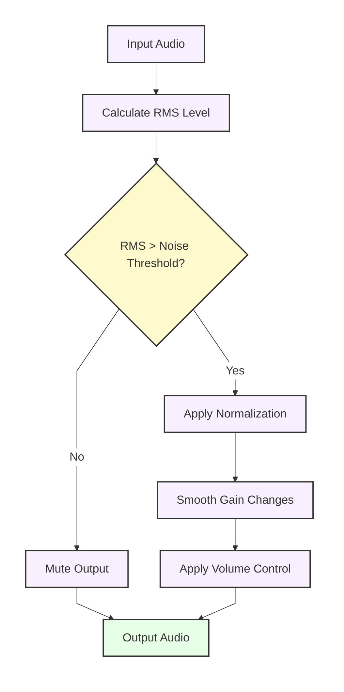
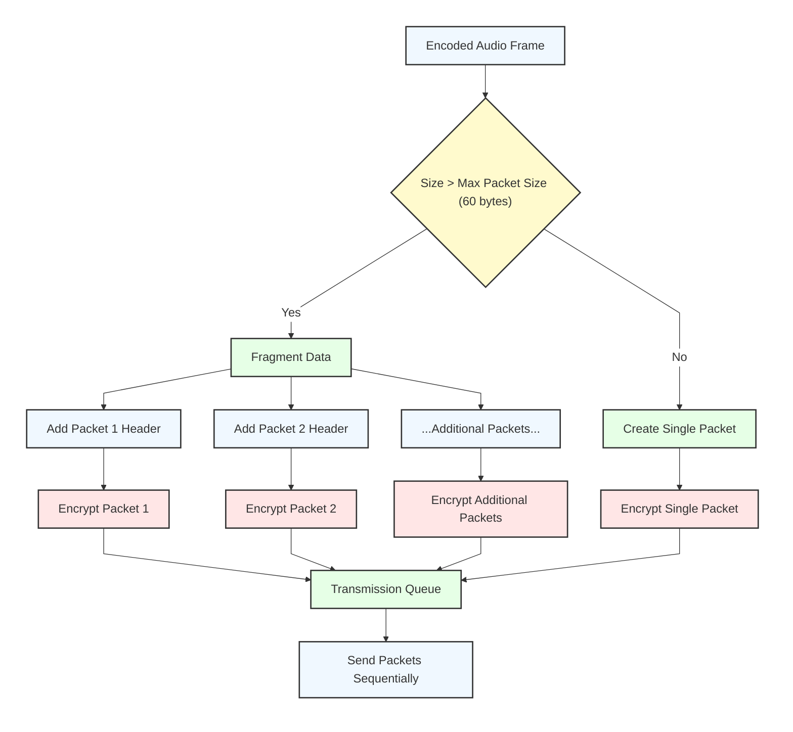
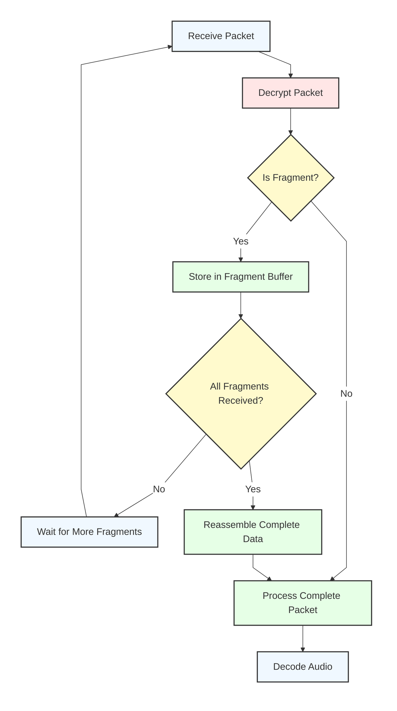

# Audio Processing and Encryption Flow

## Detailed Flowchart Views

### Audio Processing Detail

```mermaid
%%{init: {'theme': 'default', 'themeVariables': { 'fontSize': '18px', 'fontFamily': 'arial', 'edgeLabelBackground':'#ffffff', 'tertiaryColor': '#f5f5f5'}, 'flowchart': {'diagramPadding': 40, 'curve': 'linear'}} }%%
flowchart TB
    audioIn["Input Audio"] --> rmsCalc["Calculate RMS Level"]
    rmsCalc --> noiseGate{"RMS > Noise Threshold?"}
    noiseGate -->|"No"| mute["Mute Output"]
    noiseGate -->|"Yes"| normalize["Apply Normalization"]
    normalize --> gainSmooth["Smooth Gain Changes"]
    gainSmooth --> volumeAdjust["Apply Volume Control"]
    mute --> output["Output Audio"]
    volumeAdjust --> output
    
    classDef default fill:#f9f0ff,stroke:#333,stroke-width:2px;
    classDef decision fill:#fffacd,stroke:#333,stroke-width:2px;
    classDef output fill:#e6ffe6,stroke:#333,stroke-width:2px;
    
    class noiseGate decision;
    class output output;
```

### Packet Fragmentation and Transmission Process

```mermaid
%%{init: {'theme': 'default', 'themeVariables': { 'fontSize': '18px', 'fontFamily': 'arial', 'edgeLabelBackground':'#ffffff'}, 'flowchart': {'diagramPadding': 40, 'curve': 'linear'}} }%%
flowchart TB
    audioFrame["Encoded Audio Frame"] --> sizeCheck{"Size > Max Packet Size (60 bytes)"}
    
    sizeCheck -->|"No"| singlePacket["Create Single Packet"]
    sizeCheck -->|"Yes"| fragment["Fragment Data"]
    
    fragment --> packetHeader1["Add Packet 1 Header"]
    fragment --> packetHeader2["Add Packet 2 Header"]
    fragment --> morePackets["...Additional Packets..."]
    
    packetHeader1 --> encrypt1["Encrypt Packet 1"]
    packetHeader2 --> encrypt2["Encrypt Packet 2"] 
    morePackets --> encryptMore["Encrypt Additional Packets"]
    
    singlePacket --> encryptSingle["Encrypt Single Packet"]
    
    encrypt1 --> txQueue["Transmission Queue"]
    encrypt2 --> txQueue
    encryptMore --> txQueue
    encryptSingle --> txQueue
    
    txQueue --> send["Send Packets Sequentially"]
    
    
    classDef default fill:#f0f8ff,stroke:#333,stroke-width:2px;
    classDef decision fill:#fffacd,stroke:#333,stroke-width:2px;
    classDef process fill:#e6ffe6,stroke:#333,stroke-width:2px;
    classDef encrypt fill:#ffe6e6,stroke:#333,stroke-width:2px;
    
    class sizeCheck decision;
    class encrypt1,encrypt2,encryptMore,encryptSingle encrypt;
    class fragment,singlePacket,txQueue process;
```

### Packet Reassembly Process on Receiver

```mermaid
%%{init: {'theme': 'default', 'themeVariables': { 'fontSize': '18px', 'fontFamily': 'arial', 'edgeLabelBackground':'#ffffff'}, 'flowchart': {'diagramPadding': 40, 'curve': 'linear'}} }%%
flowchart TB
    receive["Receive Packet"] --> decrypt["Decrypt Packet"]
    
    decrypt --> headerCheck{"Is Fragment?"}
    
    headerCheck -->|"No"| processComplete["Process Complete Packet"]
    headerCheck -->|"Yes"| bufferStorage["Store in Fragment Buffer"]
    
    bufferStorage --> completeCheck{"All Fragments Received?"}
    
    completeCheck -->|"No"| waitMore["Wait for More Fragments"]
    completeCheck -->|"Yes"| reassemble["Reassemble Complete Data"]
    
    waitMore --> receive
    
    reassemble --> processComplete
    
    processComplete --> audioDecoding["Decode Audio"]
    
    classDef default fill:#f0f8ff,stroke:#333,stroke-width:2px;
    classDef decision fill:#fffacd,stroke:#333,stroke-width:2px;
    classDef process fill:#e6ffe6,stroke:#333,stroke-width:2px;
    classDef decrypt fill:#ffe6e6,stroke:#333,stroke-width:2px;
    
    class headerCheck,completeCheck decision;
    class decrypt decrypt;
    class reassemble,processComplete,bufferStorage process;
```
