# Audio Processing and Encryption Flow

## Detailed Flowchart Views

### Audio Processing Detail

The audio processing works to smooth the signal and make it so that if the user is far from the microphone, an audible sound is still played on the device.

### Packet Fragmentation and Transmission Process

Since the RF transceiver is limited in it's transmission speed, the audio must be encoded instead of sent raw, this reduces the amount of data that is needed to be transferred.

```mermaid
%%{init: {'theme': 'default', 'themeVariables': { 'fontSize': '18px', 'fontFamily': 'arial', 'edgeLabelBackground':'#ffffff'}, 'flowchart': {'diagramPadding': 40, 'curve': 'linear'}} }%%
flowchart TB
    %% Increase arrow thickness
    linkStyle default stroke-width:3px;

    audioFrame["Encoded Audio Frame"] --> sizeCheck{"Size > Max Packet Size (60 bytes)"}

    sizeCheck -->|"No"| singlePacket["Create Single Packet"]
    sizeCheck -->|"Yes"| fragment["Fragment Data"]

    fragment --> packetHeader1["Add Packet 1 Header"]
    fragment --> packetHeader2["Add Packet 2 Header"]
    fragment --> morePackets["...Additional Packets..."]

    packetHeader1 --> encrypt1["Encrypt Packet 1"]
    packetHeader2 --> encrypt2["Encrypt Packet 2"]
    morePackets --> encryptMore["Encrypt Additional Packets"]

    singlePacket --> encryptSingle["Encrypt Single Packet"]

    encrypt1 --> txQueue["Transmission Queue"]
    encrypt2 --> txQueue
    encryptMore --> txQueue
    encryptSingle --> txQueue

    txQueue --> send["Send Packets Sequentially"]


    classDef default fill:#f0f8ff,stroke:#333,stroke-width:2px;
    classDef decision fill:#fffacd,stroke:#333,stroke-width:2px;
    classDef process fill:#e6ffe6,stroke:#333,stroke-width:2px;
    classDef encrypt fill:#ffe6e6,stroke:#333,stroke-width:2px;

    class sizeCheck decision;
    class encrypt1,encrypt2,encryptMore,encryptSingle encrypt;
    class fragment,singlePacket,txQueue process;
```

### Packet Reassembly Process on Receiver

Since the audio data is broken up while being sent, it must be reassembled before it can be played back.

