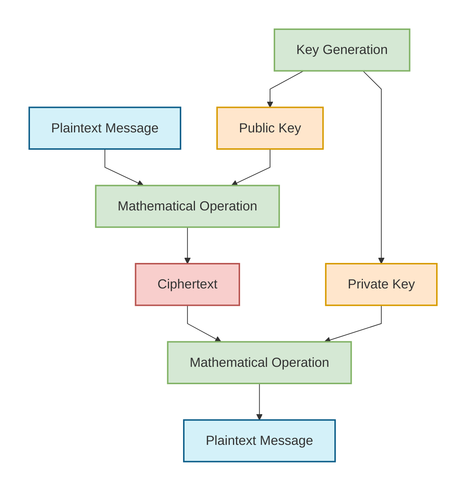
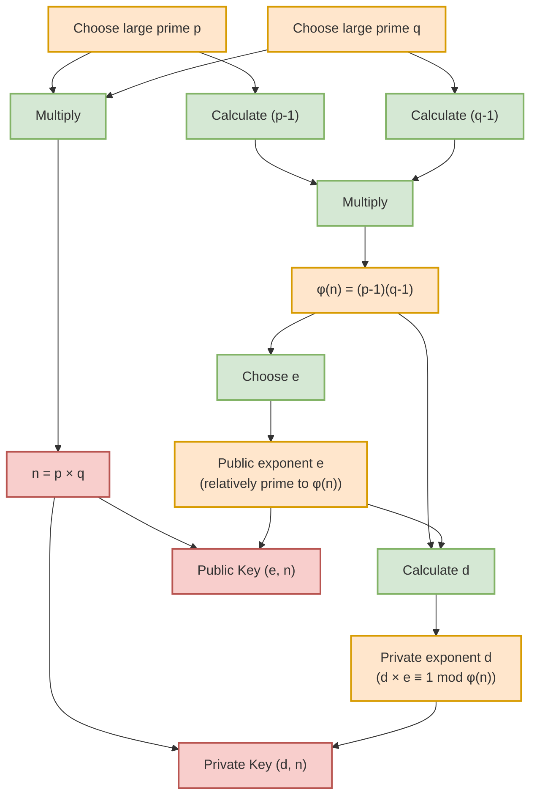
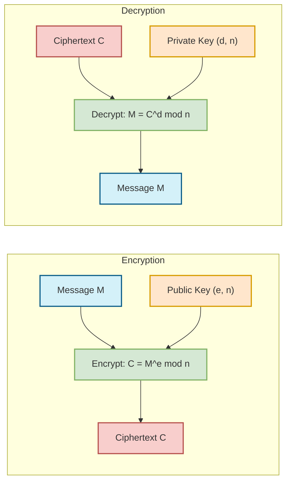
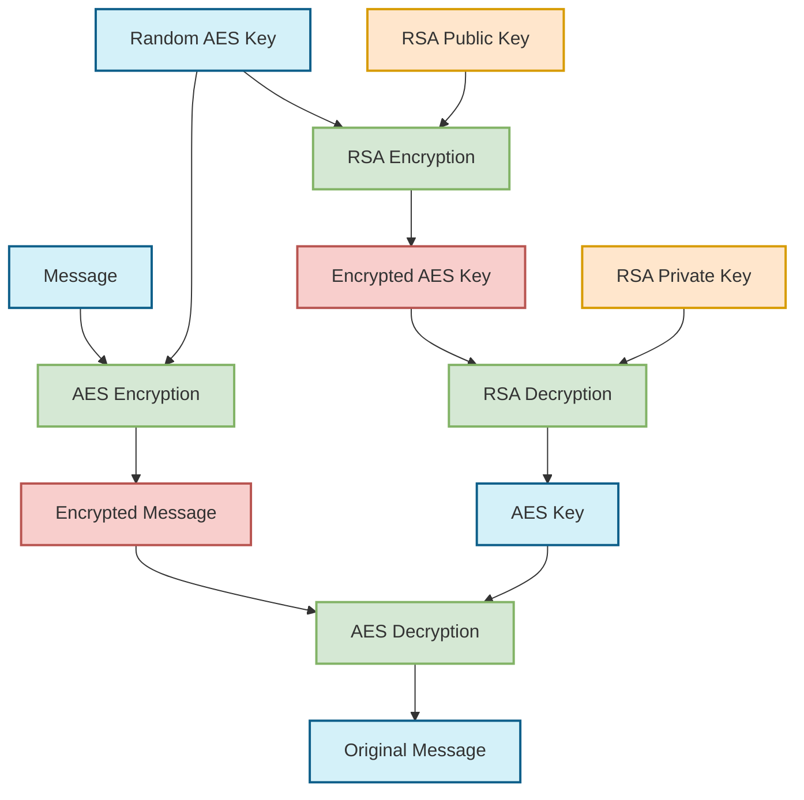

# RSA Encryption and Decryption

## RSA Overview

RSA (Rivest-Shamir-Adleman) is an asymmetric encryption algorithm that uses a pair of keys: a public key for encryption and a private key for decryption. This allows secure communication without having to share a secret key beforehand.

## Simplified RSA Process

## Key Components of RSA

1. **Key Generation**: The creation of a mathematically linked public and private key pair
2. **Public Key**: Shared openly and used to encrypt messages
3. **Private Key**: Kept secret and used to decrypt messages
4. **Mathematical Operations**: Based on the difficulty of factoring large prime numbers
5. **Modular Arithmetic**: Mathematical operations performed with remainders

## RSA Key Generation

## RSA in Action

## Advantages and Limitations of RSA

### Advantages

- **No Shared Secret**: Communicating parties don't need to share a secret key in advance
- **Digital Signatures**: Can be used to verify the sender's identity
- **Key Distribution**: Simplifies secure key exchange over insecure channels

### Limitations

- **Performance**: Significantly slower than symmetric encryption like AES
- **Key Size**: Requires large keys (2048+ bits) for security
- **Data Size**: Limited to encrypting data smaller than the key size
- **Quantum Vulnerability**: Vulnerable to quantum computing attacks

## Hybrid Encryption

Due to RSA's performance limitations, it's often used in a hybrid approach with symmetric encryption:

This hybrid approach provides:

- The security of RSA for key exchange
- The performance of AES for data encryption
- The ability to encrypt data of any size efficiently
